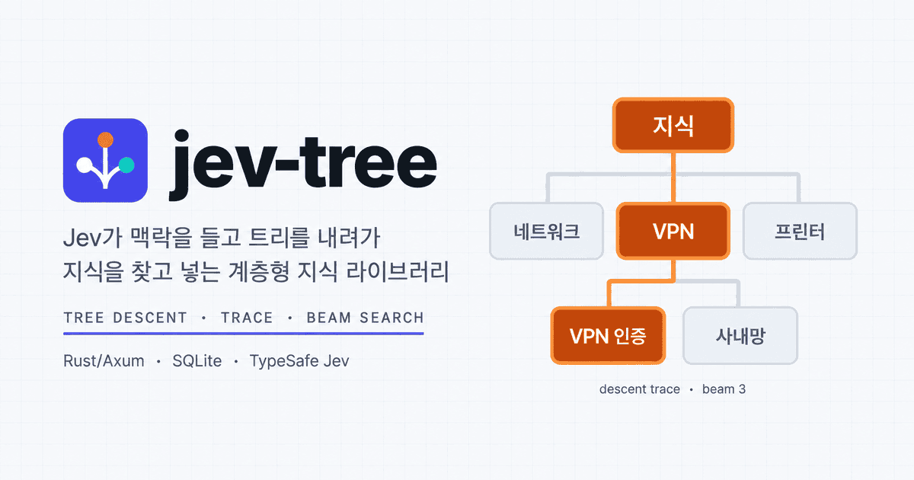
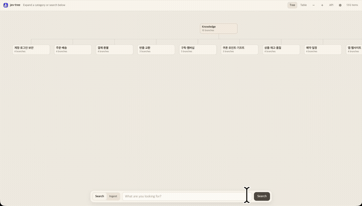

# jev-tree

<p align="center">
  
</p>

<p align="center">
  <a href="static/demo.mp4">
    
  </a>
</p>

<p align="center"><sub>▶ <a href="static/demo.mp4">Full demo video</a></sub></p>

People do not pick folders. A model carries the context down a tree and finds or files knowledge.

One Rust process (Axum + SQLite/WAL) that stores Q&A in a taxonomy and reaches it by
model-driven tree descent. **Search and ingest are the same descent.**

## Run

```bash
cargo run --release      # from the repo root
# UI    http://127.0.0.1:8768            (forest)
#        http://127.0.0.1:8768/products  (that child as the page root)
# Docs  http://127.0.0.1:8768/docs      (spec: /api/openapi.json)
```

Default paths are relative (`data/demo.db`, `data/seed.json`, `static/`), so the repo root
must be the working directory. The bundled seed is fictional: 604 categories, 1,312 items,
max depth 10.

A Jev API key is required. The LLM is optional.

| Missing | Effect |
|---|---|
| Jev API key | Search and ingest return 400. `GET /api/health` → `evaluator` is `unconfigured` |
| LLM base, token, or model | Routing stays on the Jev beam. A failed LLM call does the same |
| Login password | Open mode: every endpoint is reachable without a token |

## How it works

1. Knowledge lives in a taxonomy tree. `/` is the forest; `/products` (then
   `/products/products_stock`, …) makes that child the page root. Search and ingest
   stay inside it. Settings and keys do not.
2. At each node Jev compares the **direct children** plus one terminal option
   (`__none__` at the root, `__stop__` deeper) in the light of the full context, and descends.
   Beam search keeps `beam_width` paths, scored by the **geometric mean** of edge probabilities.
   When an LLM base URL, token, and model are all set, routing uses that model instead:
   **one call naming every node in scope**, so no choice is made blind to the rest of the
   tree. `__none__` abstains; under a `root`/`start_node` the walk stays in that subtree and
   cannot. Above 800 nodes in scope it falls back to the stepped walk (root topic, then a
   shortlist below it). If any of the three is missing, or the call fails, the Jev beam runs.
3. `search` ranks **every active item** under the selected node with Jev (Noul and Score),
   in batches of 32, then keeps `limit`. `ingest` routes a new Q&A through the same descent
   and stores it as `qa`.
4. A beam `trace` has per-depth candidates and probabilities. An LLM route lists the options
   it was shown and leaves `probability` and `trace.score` null. It does not write `1.0`.

Read a search result by role, never by `items[0]`:

| field | meaning |
|---|---|
| `items[].role` | `recommended` ≥ 0.65 · `alternative` ≥ 0.40 · else `reference` |
| `abstained: true` | top score < 0.30 — say "I don't know" |
| `leaf_id: null` | outside the tree; `items` is empty |

## API in 30 seconds

```bash
curl -s localhost:8768/api/run -H 'content-type: application/json' \
  -d '{"mode":"search","query":"my parcel is stuck at customs"}'

# same search, but only under the products subtree
curl -s localhost:8768/api/run -H 'content-type: application/json' \
  -d '{"mode":"search","query":"out of stock","root":"products"}'

# ingest files a draft and returns its item_id; publishing is a second, explicit call
curl -s localhost:8768/api/run -H 'content-type: application/json' \
  -d '{"mode":"ingest","question":"...","answer":"..."}'
```

`mode` is `search` or `ingest` only. A draft is stored with `status=draft` and stays out of
search until you re-send it with `auto_publish: true`, or drop it with
`DELETE /api/items/{id}`. Full contract: [`docs/api.md`](docs/api.md) or `/api/openapi.json`.

## Configuration

Environment variables carry deployment paths only. Runtime settings (keys, branding)
live in SQLite and are changed through `PATCH /api/settings`.

| Variable | Default | Purpose |
|---|---|---|
| `PORT` | `8768` | Listen port |
| `JEV_TREE_BIND` | `127.0.0.1` | Any non-loopback value requires a login password (see below) |
| `JEV_TREE_ALLOW_OPEN` | — | `1` allows a public bind without a login password. Understand the risk first |
| `JEV_TREE_DB` | `data/demo.db` | SQLite file |
| `JEV_TREE_SEED` | `data/seed.json` | Seed used on first boot and by `POST /api/seed` |
| `JEV_TREE_STATIC_DIR` | `static` | UI + `openapi.json` |
| `JEV_TREE_SECRET_KEY_FILE` / `JEV_TREE_SECRET_KEY` | — | Material for encrypting stored secrets; otherwise a `0600` sibling `.jev-tree.key` is created |
| `JEV_TREE_RUN_TIMEOUT_SECS` | `120` | Deadline for one search or ingest |
| `JEV_TREE_INIT_*` | — | One-way boot seed for `API_KEY`, `BASE_URL`, `TOKEN`, `MODEL`, `SERVER_KEY`. Fills **empty** DB slots only |

## Deploying

Binding anything other than loopback without a login password is refused at startup, because
open mode lets any caller claim the password and reset the database:

```bash
JEV_TREE_BIND=0.0.0.0 JEV_TREE_INIT_SERVER_KEY=<6+ chars> cargo run --release
```

`POST /api/seed` deletes every category and item. Never point it at a live database.
The bundled `Dockerfile` follows the same rules. More in
[`AGENTS.md`](AGENTS.md#deployment-safety).

## Status

`cargo fmt --check`, `cargo test --locked`, and
`cargo clippy --all-targets --locked -- -D warnings` run in CI. They cover the HTTP
contract, scripted-evaluator descent, taxonomy validation, secret handling, and the
startup guards.

The UI and `/docs` make no external requests: no CDN, no web fonts, no analytics.
CI does not call Jev. Scripted tests cover descent, the full-subtree ranking pool,
the missing-key error, and an LLM failure falling back to the beam.

Known gaps are tracked in [`AGENTS.md`](AGENTS.md#known-gaps). Read them before trusting a result.

## Evaluation

`eval/` holds a Korean golden dataset (8 general-purpose domains, 219 nodes / 669 items,
513 cases) and a runner that measures how well search and ingest file and find knowledge.
It runs in-process through `engine::execute` — no server started, nothing written to the
working tree's database.

```bash
cargo run --release --example eval -- validate --strict        # dataset check, no key needed
cargo run --release --example eval -- run --router both --variant all
```

Measured baseline (`jev-latest`; `gpt-6-luna` routes the category in `jev_llm`) over 5 tree
shapes:

| routing | E2E | Hit@1 | ingest | latency p50 |
|---|---:|---:|---:|---:|
| Jev beam | 92.1% | 91.5% | 86.8% | **1.7s** |
| LLM + Jev ranking | **98.2%** | **97.9%** | **94.1%** | 12.6s |

Three things worth knowing before trusting a result:

- **Depth hurts the Jev beam** — flat 97.0% → 88.7–89.2% routing accuracy across 2–7 levels,
  at twice the cost. The LLM router picks from every node in one call and is nearly
  depth-insensitive (95.1–97.8%).
- **Where it misses matters more than how often.** A miss sideways (sibling branch) drops the
  answer out of the candidate pool; a miss upward leaves it ranked under an ancestor and
  recoverable. Routing accuracy alone does not show this.
- **Stopping at a node prefers that node's own items.** A vague question that stops at a topic
  node is answered by that node's overview item, not something more specific from below it.
  Worth +21.7pp on vague questions (73.9% → 95.7%).

Dataset schema, metric definitions, and nine improvement proposals: [`eval/README.md`](eval/README.md).


## Documents

| File | Contents |
|---|---|
| [`AGENTS.md`](AGENTS.md) | Operating manual for agents and contributors — start here |
| [`docs/api.md`](docs/api.md) | HTTP contract |
| [`static/openapi.json`](static/openapi.json) | Machine-readable contract (hand-maintained) |
| [`eval/README.md`](eval/README.md) | Golden-set evaluation: dataset, runner, measured results |
| [`.agents/skills/bootstrap/SKILL.md`](.agents/skills/bootstrap/SKILL.md) | Building a taxonomy from raw data |

## Security

Report key or auth bugs privately — see [`SECURITY.md`](SECURITY.md).

## License

MIT — [`LICENSE`](LICENSE). Copyright (c) 2026 lee-lou2 &lt;lee@lou2.kr&gt;.
